# The Vault

> JavaScript 없이 순수 HTML + CSS만으로 구현한 멀티 카테고리 쇼케이스 플랫폼

**Live Demo:** [https://tmdry4530.github.io/kosta-html-project/](https://tmdry4530.github.io/kosta-html-project/)

## 소개

The Vault는 4개의 독립적인 섹션(F1, NFT, Knowledge, Food)을 하나의 Apple 스타일 벤토 그리드 인터페이스에 담은 웹사이트입니다. **JavaScript를 단 한 줄도 사용하지 않으며**, CSS의 상태 관리(radio/checkbox `:checked`), 선택자(`:has()`, `~`), 트랜지션만으로 모든 인터랙션을 구현합니다.

## 기획 의도

- 상품 소개, 홍보, 지식 공유를 하나의 플랫폼에서 할 수 있는 쇼케이스를 만들고 싶었습니다.
- JavaScript 없이 순수 CSS만으로 어디까지 가능한지 실험해보고 싶었습니다.

## 스크린샷

### F1 - 공식 굿즈 컬렉션
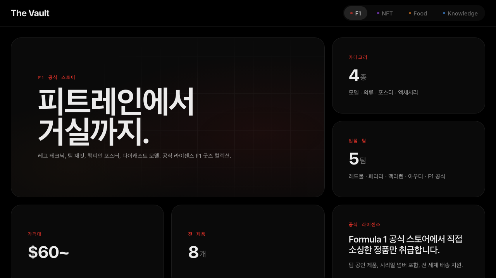
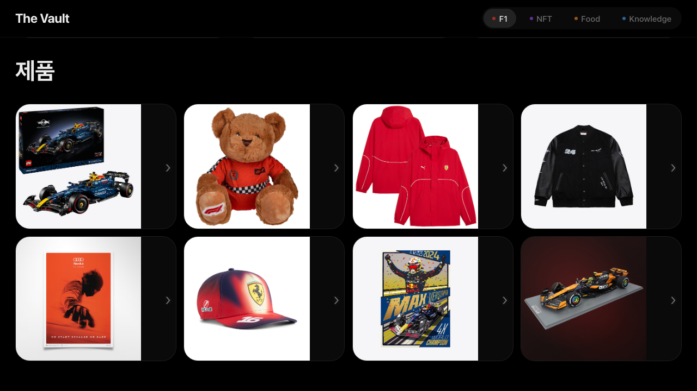
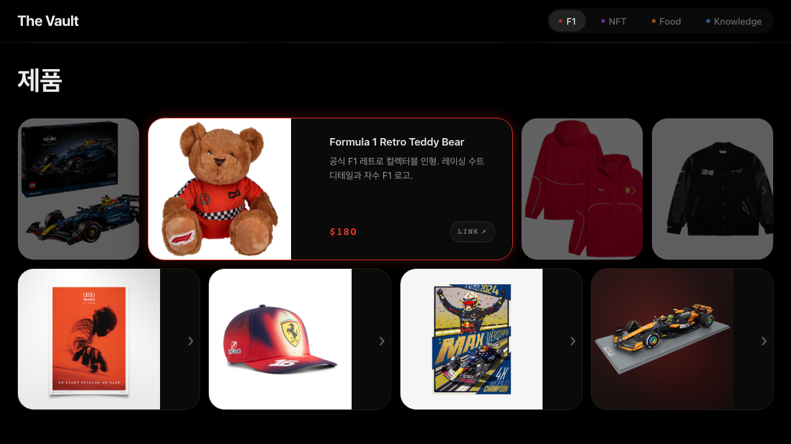

### NFT - 블루칩 NFT 갤러리
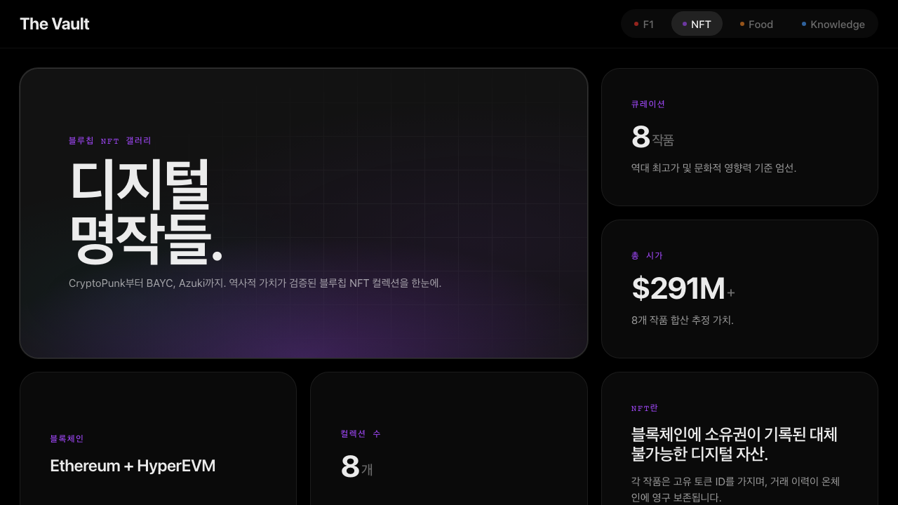
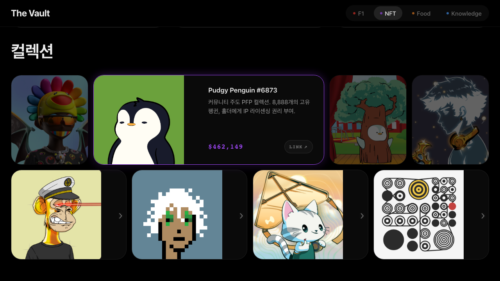

### Knowledge - 개발자 도구 사전
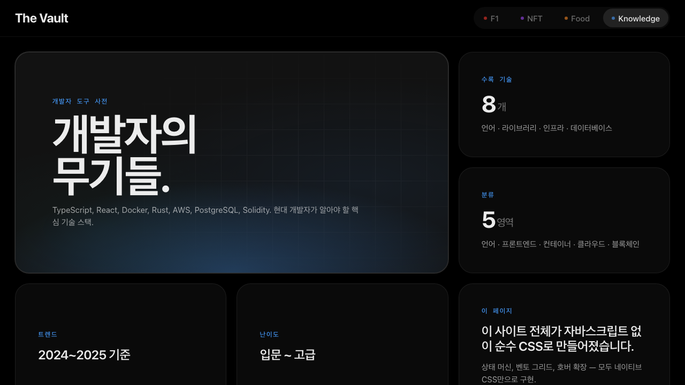
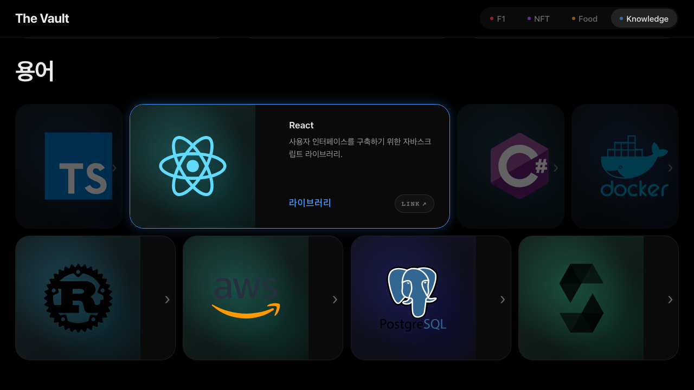

### Food - 푸드 큐레이션
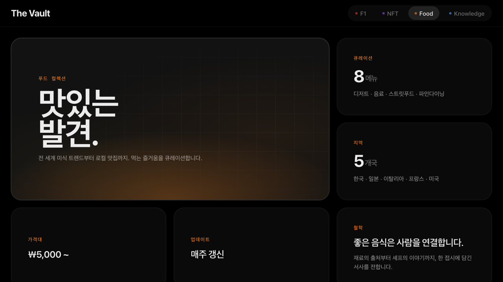
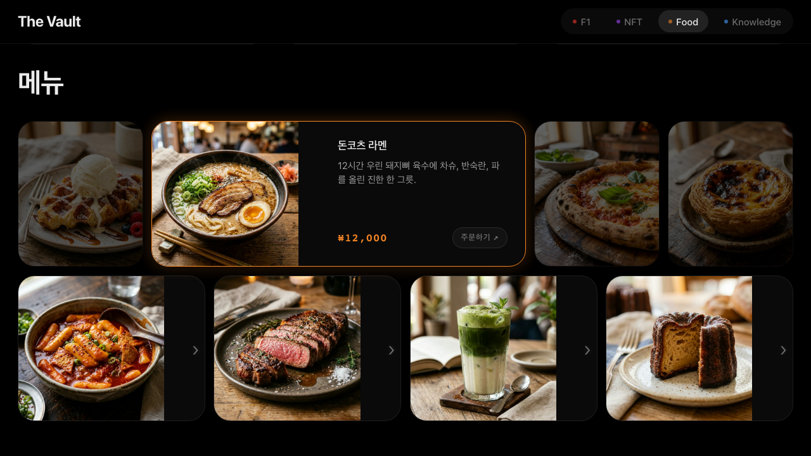
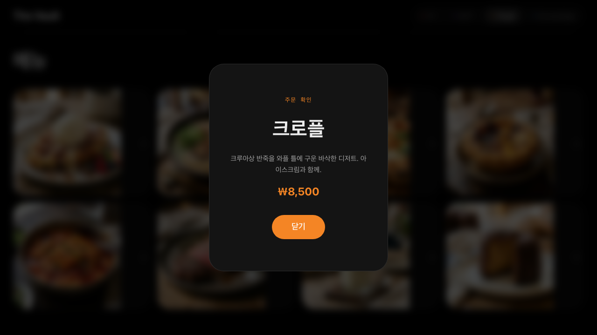

### 반응형
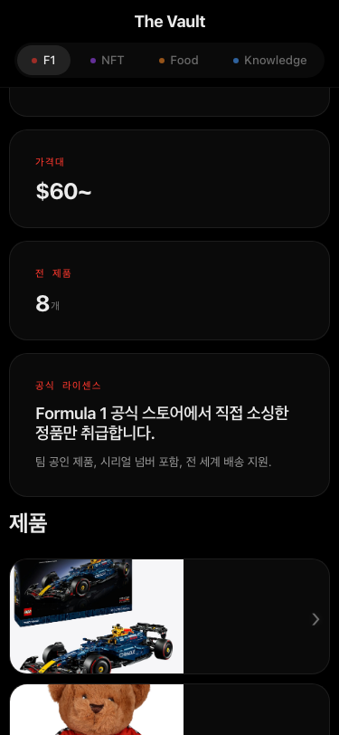

## 주요 기능

| 기능 | 구현 방식 |
|------|-----------|
| **4개 뷰 전환** | `input[type="radio"]` `:checked` + 형제 선택자 `~` |
| **섹션별 테마 자동 전환** | 뷰 상태에 따라 `--accent` CSS 변수 교체 |
| **제품 호버 확장** | `flex` 트랜지션 + `:has()` 로 같은 행 dimming |
| **CSS-only 모달** | `input[type="checkbox"]` `:checked` 로 오버레이 표시 |
| **로딩 스크린** | `@keyframes` + `animation-fill-mode: forwards` |
| **카드 입장 애니메이션** | staggered `animation-delay` (60ms 간격) |
| **반응형** | 1440px 3열 → 1024px 2열 → 768px 1열 |

## 기술 스택

- **HTML5** - 시맨틱 마크업
- **CSS3** - Custom Properties, `:has()`, `@layer`, `clamp()`, `color-mix()`
- **JavaScript** - 없음 (Zero JS)

## 파일 구조

```
├── index.html
├── styles/
│   ├── 00-reset.css        # 리셋
│   ├── 01-tokens.css       # 디자인 토큰 (색상, 타이포, 간격)
│   ├── 02-base.css         # 기본 스타일
│   ├── 03-layout.css       # 벤토 그리드 레이아웃
│   ├── 04-story.css        # 카드 컴포넌트
│   ├── 05-knowledge.css    # 카드 장식 효과
│   ├── 06-market.css       # 제품 쇼케이스 + 모달
│   ├── 07-states.css       # 상태 전환 (뷰, 테마, 모달)
│   ├── 08-motion.css       # 애니메이션
│   └── 09-utilities.css    # 유틸리티
├── images/
│   ├── f1/                 # F1 굿즈 이미지
│   ├── nft/                # NFT 아트 이미지
│   ├── food/               # 음식 이미지
│   └── knowledge/          # 개발 도구 아이콘 (devicon SVG)
└── screenshots/            # README 스크린샷
```

## CSS 아키텍처

```
radio :checked ──→ ~ .app-shell ──→ 뷰 활성화 + 테마 변수 교체
checkbox :checked ──→ ~ .app-shell .modal-overlay ──→ 모달 표시
:has(.product-item:hover) ──→ 같은 행 비호버 카드 dimming
flex transition ──→ 호버 카드 확장 + 상세설명 표시
```
